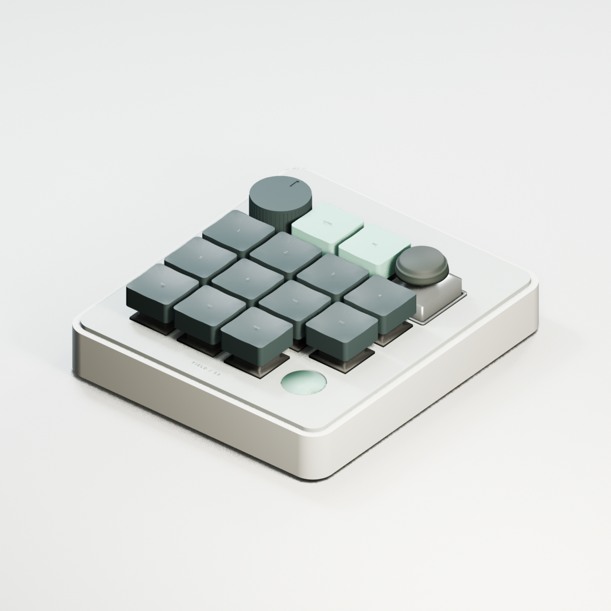
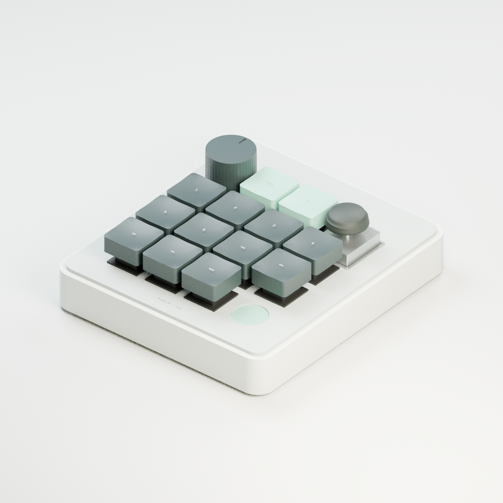
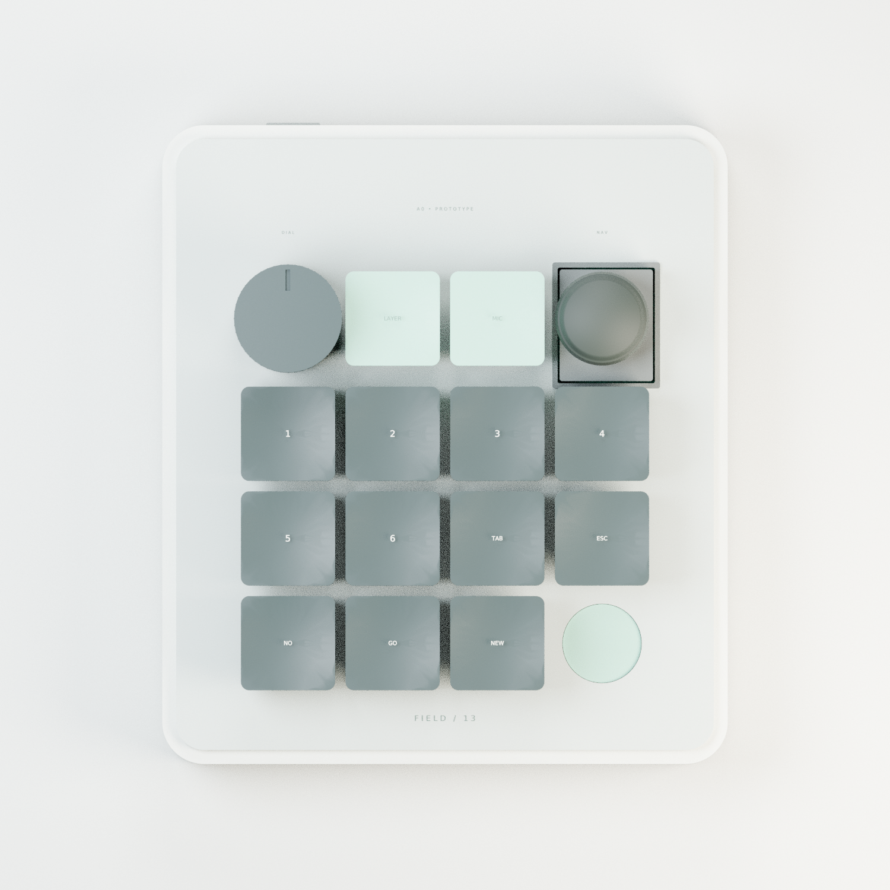
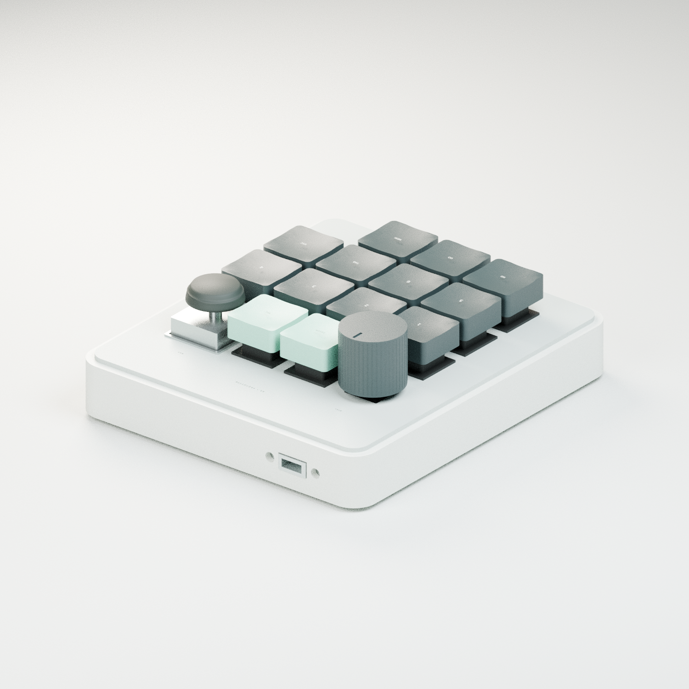
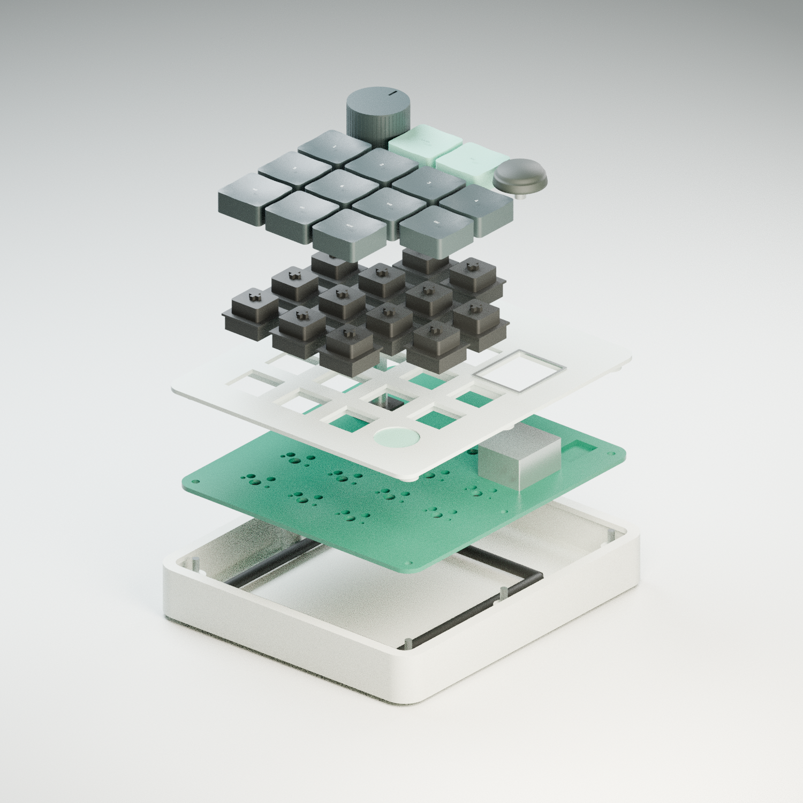

# FIELD 13

An original, editable DIY macropad prototype with 13 MX hot-swap keys, a rotary encoder, a two-axis joystick, an optional touch position and a soldered Raspberry Pi Pico W.



**A0 design prototype. Not yet a fabrication release.** The files are real CAD, PCB and source code, but there has been no physical assembly, electrical bring-up, radio test or print-fit test. Software checks and CAD clearances cannot replace those tests.

## What is here

| Area | Deliverable |
|---|---|
| Electronics | Editable KiCad schematic, two-layer routed board, custom symbol/footprint libraries, source links and check reports |
| Mechanical | Native FreeCAD full assembly, STEP, printable case/plate/knob/feet, fit coupon and reproducible parameters |
| Visuals | Direct CAD preview, studio front/top/rear views, exploded view and editable Blender studio scene |
| Firmware | Code-configured keymaps/layers, encoder/media controls, joystick arrows/mouse, USB HID, optional authenticated Windows Wi-Fi companion |
| Integration | Optional Microbridge local serial companion for six agent focus keys and LED feedback; macOS daemon baseline |
| Build | Exact-part BOM, pin map, assembly instructions, bench tests and explicit remaining validation gates |

The layout follows the requested control arrangement: encoder and joystick around two top keys, two rows of four keys, and three bottom keys next to the optional touch position. All keycaps are standard 1U. The enclosure is 108 × 122 mm, with rounded corners, rear port access, underside fasteners and TPU feet.

## Start here

1. Read [the current verification status](docs/verification.md)
2. Inspect the KiCad project in `electronics/` and [electrical notes](docs/electronics.md)
3. Review [mechanical dimensions and print-fit gates](docs/mechanical.md)
4. Use the [BOM](docs/BOM.csv) and [assembly guide](docs/assembly.md)
5. Configure [firmware and host companions](docs/firmware.md)

## Editable sources

- `electronics/macropad.kicad_sch` and the final routed `.kicad_pcb` named in the electrical notes
- `mechanical/FIELD13_assembly.FCStd` and `FIELD13_assembly.step`
- `mechanical/parameters.json` plus `scripts/generate_mechanical.py`
- `mechanical/stl/` for printable parts, including the fit coupon
- `mechanical/FIELD13_studio.blend` plus `scripts/render_blender.py`
- `firmware/config.py` for keymaps, layers, encoder direction, joystick calibration and transport

The FreeCAD document has named editable solids, design-profile sketches and a dimension reference sheet. Regenerate changed dimensions from the JSON rather than assuming that changing the displayed sheet rebuilds the BRep solids. Purchased parts use documented clearance envelopes; not every small SMT detail is reproduced in CAD.

## Connectivity limits

USB HID is the default. Pico W Wi-Fi mode uses a separately started Windows companion and explicitly configured pairing key. It is not Bluetooth HID. CircuitPython's Pico W target does not provide CYW43 BLE HID in this build. No credentials are included, and no host service installs itself.

The optional Microbridge adapter is separate from the Windows Wi-Fi companion. It targets the pinned upstream protocol and only focuses/open assigned agent slots and receives status colors. It does not impersonate the commercial device's USB identity, approve actions, reject requests or synthesize unsupported daemon controls.

Power is USB or a finished external USB power bank. There is no bare lithium cell, charger or unprotected battery circuit. The microphone is a reserved connector/bay, not a tested microphone or USB-audio implementation. Optional touch/RGB peripherals require their own physical validation.

## Gallery






## Reproduce checks

```sh
python -m unittest discover -s tests/firmware -v
python -m compileall -q firmware
/usr/bin/python3 scripts/generate_mechanical.py
HOME=/tmp/macropad-home kicad-cli sch erc electronics/macropad.kicad_sch
```

The electrical notes identify the final PCB, final ERC/DRC commands and report files. Generated file paths are relative to this repository except where a tool requires its system library path. KiCad 9.0.2, FreeCAD 1.0 and Blender 4.3.2 were used in the development VM.

## Sources and credit

The requested arrangement was inspired by [OpenAI Supply Co. × Work Louder](https://openai.com/supply/co-lab/work-louder/). FIELD 13 is an independent DIY design, not an official product, clone firmware, compatibility certification or endorsement.

Component geometry and electrical constraints are based on the manufacturer sources linked in the BOM and electrical notes. Optional Microbridge interoperability is pinned to [DevVig/microbridge, fcd0aba](https://github.com/DevVig/microbridge/tree/fcd0aba7a4fa360ca8690681bd7b049fa3682f10). Third-party datasheets and external executable tools are not republished in this repository.
